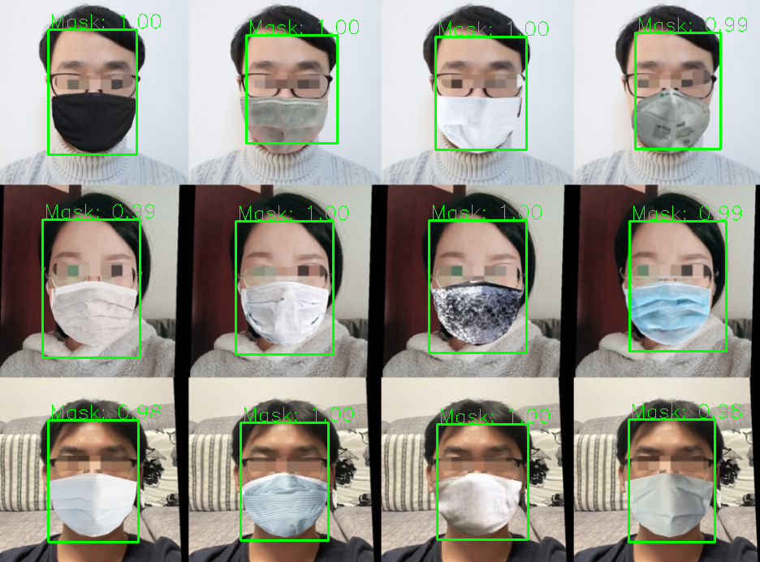
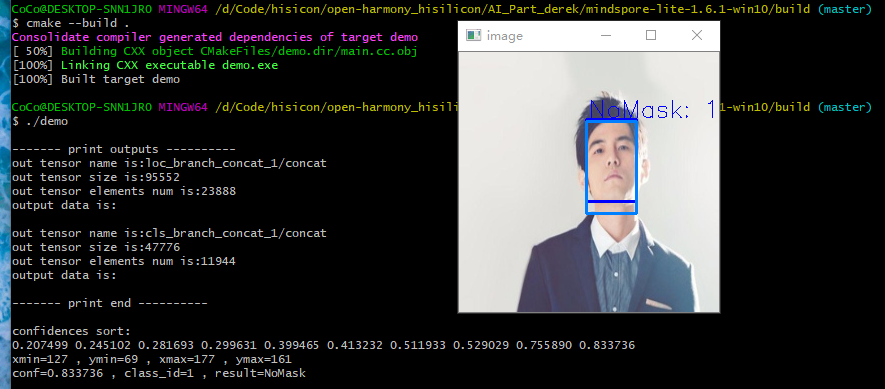

# AI Part 工作进度
## 基于Keras和TFLite的上位机模型运行
### Keras实时视频流口罩检测
在./facemaskdetect/Keras-Python目录下执行：

        Python keras_infer.py
### TFLite测试图片口罩检测
在./facemaskdetect/TFLite-Python目录下执行：
        
        Python Verify.py

## Win10上基于MindSpore Lite在Hi3516D上做AI模型部署

### 测试demo(见example):
- [x] peson_detect
- [x] facemark_detect
### Step1. TFLite模型转换
#### 1) 切换路径
.\Mindspore-lite-1.6.1-win10\tools\converter\converter
#### 2) 环境变量设置：
直接去图形界面的系统环境变量设置中添加路径：

1. (self_path)\Mindspore-lite-1.6.1-win10\tools\converter\lib
2. (self_path)\Mindspore-lite-1.6.1-win10\tools\benchmark
#### 3) 模型转换
确认待转换的TFLite模型在converter路径下

    call converter_lite.exe --fmk=TFLITE --modelFile=xxx.tflite --outputFile=xxx

结果会在当前目录生成xxx.ms格式的模型
### Step2. 模型推理
#### 1）编译环境配置
1. 确认MinGW已装好，且gcc版本大于等于7.3.0
2. 确认cmake已装好，且cmake版本大于等于3.12
3. 环境变量配置好后，在cmd测试命令确保安装成功
#### 2）编译运行
1. 确认待推理模型被复制到了model文件夹中
2. 进入build文件夹目录，执行"cmake --build ."
3. 编译无误后，执行"demo"运行
### Step3. 模型上位机验证
#### 1）行人检测
复制./mindspore-lite-1.6.1-win10/example/person_detct下的main.cc到mindspore-lite-1.6.1-win10下，直接编译运行得到person_score和no_perso_score，经过相同测试图片的输出比对，和stm32单片机上运行的结果完全一致。
#### 2）口罩检测
1. 使用Tensorflow Lite进行验证，在./facemaskdetect/TFLite-Python目录下运行python Verify.py可以对路径下的图片进行检测，依赖环境：tensorflow2.5.0、opencv、numpy。
2. 使用Mindspore Lite进行验证，复制./mindspore-lite-1.6.1-win10/example/face_mask_detect下的main.cc到mindspore-lite-1.6.1-win10下，直接编译运行得到坐标框坐标、置信度、分类结果信息，可以在Python代码中用opencv输入坐标验证检测效果。
3. Mindspore Lite和TF Lite的运行结果存在一些误差，应该是浮点数精度引起的。所有的预处理和后处理代码都采用C语言编写，方便以后移植到其它平台。
4. 测试效果如下：深蓝色为TF Lite推理的结果，浅蓝色为Mindspore Lite推理的结果

### Step4. 模型下位机验证
#### 1) NNIE专用模型转换
所有转换所需要用到的材料都提供在./mindspore-lite-1.6.1-nnie中
1. 下载NNIE专用converter转换工具，打开WSL窗口进行解压，然后在WSL中导入环境变量：

        export LD_LIBRARY_PATH=/mnt/d/Code/hisicon/NNIE/mindspore-lite-1.6.1-linux-x64:/mnt/d/Code/hisicon/NNIE/mindspore-lite-1.6.1-linux-x64/tools/converter/lib:/mnt/d/Code/hisicon/NNIE/mindspore-lite-1.6.1-linux-x64/runtime/lib:/mnt/d/Code/hisicon/NNIE/mindspore-lite-1.6.1-linux-x64/tools/converter/providers/Hi3516D/third_party/opencv-4.2.0:/mnt/d/Code/hisicon/NNIE/mindspore-lite-1.6.1-linux-x64/tools/converter/providers/Hi3516D/third_party/protobuf-3.9.0

        cd ${PACKAGE_ROOT_PATH}/tools/converter/converter
        
        export NNIE_MAPPER_PATH=/mnt/d/Code/hisicon/NNIE/mindspore-lite-1.6.1-linux-x64/tools/converter/providers/Hi3516D/libnnie_mapper.so

        export NNIE_DATA_PROCESS_PATH=/mnt/d/Code/hisicon/NNIE/mindspore-lite-1.6.1-linux-x64/tools/converter/providers/Hi3516D/libmslite_nnie_data_process.so

        export BENCHMARK_PATH=/mnt/d/Code/hisicon/NNIE/mindspore-lite-1.6.1-linux-x64/tools/benchmark

        export NNIE_CONFIG_PATH=./nnie.cfg

2. 自己编写nnie.cfg和input_nchw.txt
- nnie.cfg中的内容

        [net_type] 0
        [image_list] ./input_nchw.txt
        [image_type] 0
        [norm_type] 0
        [mean_file] null

- input_nchw.txt中的内容

image_list参数介绍可以参考《HiSVP开发指南》的第90页（右下角页码），这里使用Python+opencv做input_nchw.txt生成

        img_raw = cv2.imread(str(img_path))
        image = cv2.resize(img_raw, (260, 260), cv2.INTER_AREA) # 改变尺寸 
        fp = open('input.txt' , mode='w')
        for i in range(0,260):
            for j in range(0,260):
                for k in range(0,3):
                    fp.write(str(image[i][j][k]/255.0)+' ')
        fp.close()
3. NNIE模型转换

目前NNIE转换器只支持caffe模型，执行：

        ./converter_lite --fmk=CAFFE --modelFile=${model_name}.prototxt --weightFile=${model_name}.caffemodel --configFile=./converter.cfg --outputFile=${model_name}

运行后的结果显示为：

        CONVERTER RESULT SUCCESS:0
#### 2) 在Hi3516上进行Runtime测试

### Step5. 集成推理